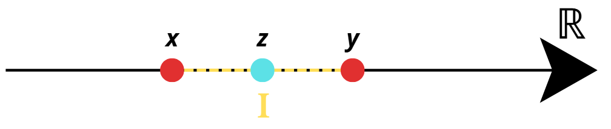

# Insiemi Numerici e Intervalli su ℝ

## 1. Insiemi Numerici

Gli insiemi numerici fondamentali sono in relazione di inclusione tra loro:  
\[
ℕ ⊂ ℤ ⊂ ℚ ⊂ ℝ
\]

| Simbolo | Nome | Definizione |
| :--- | :--- | :--- |
| **ℕ** | Numeri Naturali | Insieme degli interi non negativi: ℕ = {0, 1, 2, 3, 4, ...}. |
| **ℤ** | Numeri Interi | Insieme degli interi positivi e negativi: ℤ = {..., -2, -1, 0, 1, 2, ...}. |
| **ℚ** | Numeri Razionali |Insieme dei numeri che possono essere espressi come frazioni p/q, dove p, q sono elementi di Z (numeri interi) e q è diverso da 0. Rappresentano classi di equivalenza di frazioni. |
| **ℝ** | Numeri Reali | Insieme che include tutti i numeri razionali e irrazionali (ad esempio √2 o π). |

## 2. Relazioni tra Insiemi

Gli insiemi sono inclusi l'uno nell'altro:  
\[
ℕ ⊂ ℤ ⊂ ℚ ⊂ ℝ
\]

---

## 3. Intervalli in ℝ

Un **intervallo** I ⊂ ℝ è un sottoinsieme dei numeri reali che non contiene "buchi".  

**Definizione:** Un sottoinsieme *I ⊂ ℝ* si dice intervallo se, presi due elementi qualsiasi *x, y ∈ I* con *x < y*, ogni elemento z tale che x < z < y appartiene anch'esso a I.  

### Notazione degli intervalli

Dati a, b ∈ ℝ con a < b, si distinguono i seguenti tipi di intervallo:

| Tipo di Intervallo | Notazione         | Definizione          |
| :----------------  | :---------------- | :------------------  |
| **Chiuso**         | [a, b]            | {x ∈ ℝ : a ≤ x ≤ b} |
| **Aperto**         | (a, b) o ]a, b[   | {x ∈ ℝ : a < x < b} |
| **Semi-aperto**    | [a, b)            | {x ∈ ℝ : a ≤ x < b} |
| **Semi-aperto**    | (a, b]            | {x ∈ ℝ : a < x ≤ b} |

### Semirette (Intervalli illimitati)

| Tipo              | Notazione | Definizione       |
| :---------------- | :-------  | :--------------   |
| Semiretta chiusa  | [a, +∞)   | {x ∈ ℝ : x ≥ a}   |
| Semiretta aperta  | (a, +∞)   | {x ∈ ℝ : x > a}   |
| Asse reale intero | (-∞, +∞)  | ℝ                 |

### Esempi di intervalli

A = {x ∈ ℝ : 2 < x < 3}   

**È un intervallo aperto**

B = {x ∈ ℝ : 1 ≤ x < 2 oppure 6 < x < 7}   

**Non è un intervallo**  
Spiegazione: Prendiamo **x** appartenente all'intervallo [1, 2) ad esempio 1.5 e **y** appartenente all'intervallo (6, 7) ad esempio 6.3.  
Andando a prendere un numero **z** maggiore di 1.5 e minore di 6.3 ad esempio 5 possiamo vedere che il numero non appartiene all'intervallo B proposto dall'esercizio e per questo B non è un intervallo.