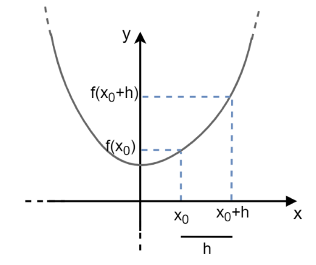
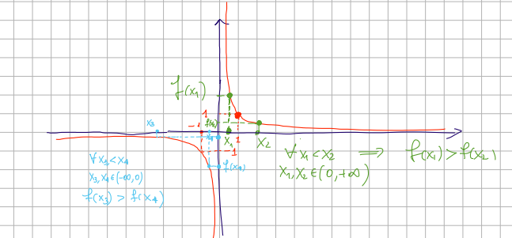

# Funzioni Inverse, Monotone e Simmetrie

## 1. Funzione Inversa (f⁻¹)

### Requisito Fondamentale: La Biettività

**Regola**: Solo le funzioni **biettive** ammettono una funzione inversa, che si indica con f⁻¹.

**Motivazione**: La funzione deve essere sia iniettiva che suriettiva per garantire che per ogni elemento b in B, esista **uno e un solo** elemento a in A che le corrisponda (ovvero, che f(a) = b).

1. **Suriettività Garantisce l'Esistenza**:  
   **Spiegazione**: Per ogni b in B (il nuovo Dominio), la suriettività garantisce che *esiste almeno* un elemento a in A tale che f(a) = b. Non ci sono "buchi" nel Codominio originale.

2. **Iniettività Garantisce l'Unicità**:  
   **Spiegazione**: L'iniettività garantisce che l'elemento a trovato sia **unico**. Senza questa proprietà, l'inversa non saprebbe quale dei due (o più) a restituire.

**Conclusione**: Solo quando è biettiva, la funzione inversa può essere definita in modo univoco in quanto siamo sicuri che manterrà le caratteristiche viste in "Regola Fondamentale (Proprietà delle Corrispondenze)" precedentemente.

### Definizione e Trasformazione

* La funzione inversa scambia il ruolo di dominio e codominio: f⁻¹: B → A.
* **Definizione Formale**:  
  f⁻¹(b) = a ⇔ f(a) = b  
  **In poche parole**: L'inversa prende un valore b (output di f) e restituisce il suo input originale a.

**Esempio**:  
f(x) = x², f: [0, +∞) → [0, +∞).  
Questo significa che sappiamo che sia il dominio che il codominio hanno x e y ≥ 0.  
Una funzione con questo dominio e questo codominio è per definizione **biettiva quindi invertibile**.  
Quindi dobbiamo trovare un numero x tale che x² = y cioè **x = √y**.

### Osservazioni

* **Se f(x) è biettiva allora f⁻¹ sarà biettiva**
* **(x,y) ∈ graph(f) ⇔ (y,x) ∈ graph(f⁻¹)** quindi y = f(x) ⇔ f⁻¹(y) = x
* Se f(x) è una funzione invertibile **i grafici di f e di f⁻¹ sono perfettamente simmetrici rispetto alla retta y = x** (vedi foto sotto)


---

## 2. Funzioni Monotone

Una funzione f: A → B, dove A, B ⊂ ℝ, è detta monotona se, per ogni scelta di due elementi x₁, x₂ nel dominio A con x₁ < x₂, la relazione tra i loro valori f(x₁) e f(x₂) rimane sempre dello stesso tipo.  
In poche parole se presi due numeri a caso x₁ e x₂ dove x₂ è più grande di x₁, f(x₁) è sempre ≤ o < o ≥ o > di f(x₂).

### Termini Generali

| Tipo di Monotonia           | Condizione per x₁ < x₂ | Descrizione                                                   | Proprietà    |
|-----------------------------|------------------------|---------------------------------------------------------------|--------------|
| 1. Strettamente Crescente   | f(x₁) < f(x₂)          | All'aumentare di x, f(x) aumenta rigorosamente.              | È iniettiva. |
| 2. (Debolmente) Crescente   | f(x₁) ≤ f(x₂)          | All'aumentare di x, f(x) può aumentare o rimanere costante.  |              |
| 3. Strettamente Decrescente | f(x₁) > f(x₂)          | All'aumentare di x, f(x) diminuisce rigorosamente.           | È iniettiva. |
| 4. (Debolmente) Decrescente | f(x₁) ≥ f(x₂)          | All'aumentare di x, f(x) può diminuire o rimanere costante.  |              |

* **Strettamente Monotona**: Si dice strettamente monotona se è strettamente crescente (1) o strettamente decrescente (3).
* **(Debolmente) Monotona**: Si dice (debolmente) monotona se è crescente (2) o decrescente (4).


Nell'immagine sopra possiamo notare che **A** è una funzione **(Debolmente) monotona** in quanto **(Debolmente) crescente** visto che fino al punto arancione **f(x₁) = f(x₂)** mentre che **B** è una funzione **strettamente monotona** in quanto **strettamente crescente** visto che f(x₁) < f(x₂).  
Si noti che una retta orizzontale sarà contemporaneamente **(Debolmente) crescente e decrescente** in quanto, per tutti i valori possibili di x₁ e x₂, f(x₁) sarà uguale f(x₂).

### Osservazioni

#### **Conservazione e Inversione dell'Ordinamento**

Le funzioni monotone hanno un effetto prevedibile sulle disuguaglianze tra i valori nel dominio:

**Funzione Crescente (Strettamente o Debolmente)**:  
Se f è crescente, essa mantiene l'ordinamento.

* Se x₁ < x₂, allora f(x₁) < f(x₂) (se strettamente crescente).
* Se x₁ < x₂, allora f(x₁) ≤ f(x₂) (se debolmente crescente).

**Spiegazione Semplice**: Se un numero è più piccolo di un altro (x₁ < x₂), l'immagine del primo numero attraverso la funzione crescente f(x₁) rimarrà più piccola (o uguale) dell'immagine del secondo f(x₂). La disuguaglianza non cambia verso.

**Funzione Decrescente (Strettamente o Debolmente)**:  
Se f è decrescente, essa inverte l'ordinamento.

* Se x₁ < x₂, allora f(x₁) > f(x₂) (se strettamente decrescente).
* Se x₁ < x₂, allora f(x₁) ≥ f(x₂) (se debolmente decrescente).

**Spiegazione Semplice**: Se un numero è più piccolo di un altro (x₁ < x₂), l'immagine del primo numero f(x₁) diventerà più grande (o uguale) dell'immagine del secondo f(x₂). La disuguaglianza cambia verso (ad esempio, da < a >).

#### **Monotonia e Rapporto Incrementale**

Questa osservazione fornisce un modo matematico molto potente per verificare la stretta monotonia usando il Rapporto Incrementale.

Una funzione f è **strettamente crescente se e solo se** il suo Rapporto Incrementale è sempre positivo:
```
  f(x₁) - f(x₂)
  ------------- > 0
   x₁ - x₂
```

per ogni x₁, x₂ nel dominio A con x₁ ≠ x₂.

**Spiegazione Semplice**:

1. Il numeratore (f(x₁) - f(x₂)) è la differenza tra i valori y (chiamata Δy).
2. Il denominatore (x₁ - x₂) è la differenza tra i valori x (chiamata Δx).
3. Il Rapporto Incrementale è il rapporto Δy/Δx, che geometricamente rappresenta la pendenza della retta secante che collega i due punti (x₁, f(x₁)) e (x₂, f(x₂)) sul grafico.
4. Affinché una funzione sia strettamente crescente, la pendenza tra due punti qualsiasi deve essere sempre positiva (la retta deve "salire" andando da sinistra a destra). Questo è garantito se il numeratore e il denominatore hanno sempre lo stesso segno: se Δx è positivo, anche Δy deve essere positivo, e viceversa.



#### **Monotonia e Rapporto Incrementale (Decrescente)**

La stessa osservazione sul rapporto incrementale si applica alle funzioni strettamente decrescenti.

**Regola**: Una funzione f è **strettamente decrescente se e solo se** il suo Rapporto Incrementale è sempre negativo:
```
  f(x₁) - f(x₂)
  ------------- < 0
   x₁ - x₂
```

per ogni x₁ ≠ x₂ nel dominio.

**Spiegazione Semplice (Segni Discordi)**: Il rapporto deve essere negativo. Questo significa che il numeratore (f(x₁) - f(x₂), la differenza sulle y) e il denominatore (x₁ - x₂, la differenza sulle x) devono essere di segno discorde (uno positivo e l'altro negativo).

* Se x₁ - x₂ > 0 (cioè x₁ > x₂), la funzione è decrescente, quindi f(x₁) deve essere minore di f(x₂), rendendo il numeratore negativo. (Negativo / Positivo = Negativo).

**Monotonia Debole (Analogamente)**: Si applica lo stesso principio per la monotonia debole:

* f è debolmente crescente se (f(x₁) - f(x₂))/(x₁ - x₂) ≥ 0.
* f è debolmente decrescente se (f(x₁) - f(x₂))/(x₁ - x₂) ≤ 0.

#### **Esempio Cruciale: f(x) = 1/x**

Viene analizzata la funzione iperbole f(x) = 1/x.

* **Dominio A**: ℝ \ {0} (tutti i numeri reali tranne x = 0).

**Analisi della Monotonia su Intervalli Separati**

La funzione è strettamente decrescente su ciascuno dei due intervalli che compongono il dominio:

1. **Intervallo Positivo (0, +∞)**:
   * Scegliamo x₁ < x₂ in (0, +∞).
   * In questo intervallo, si ha f(x₁) > f(x₂).
   * **Conclusione**: f è strettamente decrescente in (0, +∞).

2. **Intervallo Negativo (-∞, 0)**:
   * Scegliamo x₃ < x₄ in (-∞, 0).
   * Anche in questo intervallo, si ha f(x₃) > f(x₄).
   * **Conclusione**: f è strettamente decrescente in (-∞, 0).

**Il Controesempio**

Nonostante la funzione sia decrescente in ogni singolo "pezzo" del dominio, la conclusione è:

**Ma f non è decrescente su (-∞, 0) ∪ (0, +∞).**

* **Perché?** Per verificare la monotonia sull'intero dominio A, dobbiamo confrontare due punti scelti ovunque in A.
* **Controesempio fornito**: Si prendono x₁ = -1 (nel dominio negativo) e x₂ = 1 (nel dominio positivo).
  * Scegliamo x₁ < x₂: -1 < 1 (Vero).
  * Calcoliamo i valori della funzione:
    * f(x₁) = f(-1) = 1/(-1) = -1.
    * f(x₂) = f(1) = 1/1 = 1.
  * Confrontiamo f(x₁) e f(x₂): -1 < 1, quindi f(x₁) < f(x₂).
  * **Risultato**: Dato che x₁ < x₂ ha portato a f(x₁) < f(x₂), la funzione si è comportata in modo crescente in quel salto, contraddicendo la definizione di funzione decrescente sull'intero dominio A.

**Morale dell'Esempio**: Una funzione deve essere definita come monotona sull'intero insieme in cui si afferma che lo sia. Se ci sono "salti" o discontinuità (come in x = 0), non si può estendere la proprietà dagli intervalli alla loro unione se la proprietà viene violata nel passaggio tra gli intervalli.



---

## 3. Composizione di Funzioni Monotone

**Definizione**: Siano f: A → B e g: B → C due funzioni.  
La funzione composta è (g ∘ f)(x) = g(f(x)).

La monotonia della funzione composta è determinata dalla combinazione della monotonia di f (interna) e g (esterna).

### Regola Fondamentale (Prodotto dei Segni)

La composizione di funzioni si comporta come il prodotto dei segni:

* Crescente ≈ segno + (mantiene l'ordinamento).
* Decrescente ≈ segno - (inverte l'ordinamento).

| f (Interna) | g (Esterna) | g∘f (Composta) | Prodotto dei Segni |
|-------------|-------------|----------------|--------------------|
| Crescente   | Crescente   | Crescente      | (+) × (+) = (+)    |
| Crescente   | Decrescente | Decrescente    | (+) × (-) = (-)    |
| Decrescente | Crescente   | Decrescente    | (-) × (+) = (-)    |
| Decrescente | Decrescente | Crescente      | (-) × (-) = (+)    |

**Osservazione**: La Proposizione è vera anche per la stretta monotonia.

### Esempio: h(x) = e^(x³)

La funzione h(x) = e^(x³) si ottiene per composizione di:

1. Funzione interna f(x) = x³
2. Funzione esterna g(t) = eᵗ

* f(x) = x³ è strettamente crescente.
* g(t) = eᵗ è strettamente crescente.
* **Conclusione**: Per la regola del prodotto dei segni (+ × +), h = g ∘ f è strettamente crescente.

---

## 4. Monotonia e Iniettività

### Proposizioni Fondamentali

**Regola 1**: Se f è strettamente monotona (strettamente crescente o strettamente decrescente), allora f è iniettiva.

* **Spiegazione**: La stretta monotonia garantisce che se x₁ ≠ x₂, allora f(x₁) ≠ f(x₂), che è la definizione di iniettività.

**Regola 2**: Anche la composizione di funzioni iniettive è iniettiva.

**Attenzione (Il Viceversa)**: Se f è iniettiva, f non è necessariamente monotona.

* **Esempio**: La funzione f(x) = 1/x (definita su ℝ \ {0}) è iniettiva, ma abbiamo visto che non è monotona sull'intero dominio (si comporta in modo crescente nel passaggio da un quadrante all'altro).


## 5. Dominio Naturale (o Insieme di Definizione)

### Definizione

* Il **dominio naturale** (o **insieme di definizione**) di una funzione è il più grande sottoinsieme di ℝ dove ha senso scrivere la funzione.

### Esempio

* **Funzione**: f(x) = 1/x
* **Dominio Naturale**: ℝ \ {0} (l'insieme dei numeri reali escluso lo zero).

### Esempio Continuato: f(x) = 1/x

Abbiamo visto che f(x) = 1/x è iniettiva, ma non è decrescente sull'intero dominio A = (-∞, 0) ∪ (0, +∞).

* **Scelta dei Punti**: Scegliamo un punto nel quadrante negativo (x₁) e uno nel quadrante positivo (x₂).

| x₁  | Relazione | x₂ | f(x₁) | Relazione | f(x₂) | Conclusione |
|-----|-----------|-------|-------|-----------|-------|-------------|
| -1  | <         | 1     | -1    | <         | 1     | Violazione! |

* **Risultato**: Dato che x₁ < x₂ ha portato a f(x₁) < f(x₂), la funzione si è comportata in modo crescente in questo salto, pur essendo decrescente in ogni intervallo.

Questo dimostra il punto: una funzione deve essere definita come monotona sull'intero insieme in cui si afferma che lo sia.

---

## 6. Simmetrie delle Funzioni

Per definire funzioni pari e dispari, il dominio della funzione deve essere simmetrico rispetto all'origine (ovvero, se x è nel dominio, anche -x deve esserlo).

### Funzione PARI (Simmetria rispetto all'asse y)

* **Definizione**: f si dice PARI se f(x) = f(-x) per ogni x nel dominio.
* **Grafico**: Il grafico è simmetrico rispetto all'asse y.
* **Esempio**: f(x) = x²
  * f(-x) = (-x)² = x² = f(x), quindi f è pari.

### Funzione DISPARI (Simmetria rispetto all'origine)

* **Definizione**: f si dice DISPARI se f(-x) = -f(x) per ogni x nel dominio.
* **Grafico**: Il grafico è simmetrico rispetto all'origine.
* **Esempio**: f(x) = x³
  * f(-x) = (-x)³ = -x³ = -f(x), quindi f è dispari.


Nell'immagine sopra potete vedere una funzione pari (**A**) ed una funzione dispari (**B**)

---

## 7. Funzioni Periodiche

**Definizione**: Una funzione f si dice periodica di periodo P ∈ ℝ se f(x + P) = f(x).

* **Requisito Dominio**: Se x è nel dominio, anche x + P deve esserlo.
* **Esempio**: f(x) = sin(x) è periodica di periodo P = 2π.

